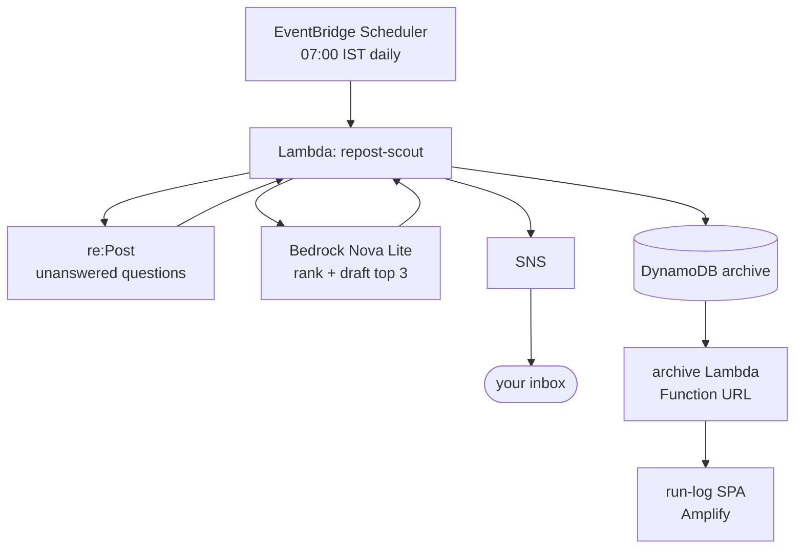

# re:Post Scout

**An agent that runs while you sleep.** Every morning at 07:00 IST it searches AWS re:Post for fresh unanswered questions in my lanes, has Amazon Bedrock (Nova Lite) pick the three I can genuinely answer, drafts an answer outline for each in my voice, emails me the brief — and archives every run to a public log.

Built for the AWS Builder Center **Weekend Agent Challenge** (July 17–20, 2026).

📄 Challenge article: _[link once published]_
🌅 Live run log: _[Amplify URL once deployed]_

## Why

I'm an AWS Community Builder and I try to answer questions on re:Post. "Try" is the honest word — some weeks five, some weeks zero, depending on whether I remember to go looking. Scout removes the remembering. I read one email over coffee, spend 15 minutes polishing the best outline, and post.

## Architecture



Six services, one CloudFormation template, no API Gateway (a Lambda Function URL is enough for a read-only endpoint). Function code is inline in the template — clone, deploy, done.

## Repo layout

```
template.yaml        # the entire backend — deploy this
src/scout/index.py   # readable copy of the agent code (canonical copy is inline in template.yaml)
src/archive/index.py # readable copy of the archive endpoint code
frontend/index.html  # the run-log SPA — host on Amplify (or any static host)
scripts/deploy.sh    # deploy + seed + fetch outputs, one command
docs/                # challenge article draft + screenshots
```

## Deploy

Prereqs: AWS CLI configured, us-east-1 (or any Bedrock region), Nova Lite model access enabled in the Bedrock console (Model access → Amazon → Nova Lite).

```bash
./scripts/deploy.sh you@example.com
```

or manually:

```bash
aws cloudformation deploy \
  --template-file template.yaml \
  --stack-name repost-scout \
  --capabilities CAPABILITY_NAMED_IAM \
  --region us-east-1 \
  --parameter-overrides RecipientEmail=you@example.com
```

Then:

1. **Confirm the SNS subscription** — one email, one click. That's the entire email setup (no SES identities, no sandbox).
2. **Seed the log** — invoke once so the archive isn't empty:
   ```bash
   aws lambda invoke --function-name repost-scout --region us-east-1 /tmp/out.json && cat /tmp/out.json
   ```
3. **Wire the frontend** — copy the `ArchiveApiUrl` stack output into `API_URL` at the top of `frontend/index.html`.
4. **Host it** — Amplify Console → New app → *Deploy without Git* → drag a zip of `frontend/`. Live in ~1 minute.

## Parameters

| Parameter | Default | Notes |
|---|---|---|
| `RecipientEmail` | — | Where the daily brief lands |
| `Topics` | `bedrock,fargate,cost optimization,cloudformation` | Comma-separated re:Post search terms — set your own lanes |
| `ScheduleExpression` | `cron(30 1 * * ? *)` | 01:30 UTC = 07:00 IST |
| `ModelId` | `amazon.nova-lite-v1:0` | Any Bedrock model supporting Converse |

The agent prompt (inside `template.yaml`, in the scout Lambda) is opinionated on purpose: it knows my lanes, skips vague and billing-support posts, and is told to write "verify X" instead of inventing details. Edit it to sound like you.

## Evidence it runs without you

- The live run log — every entry stamped with its 07:00 IST run time
- EventBridge Scheduler console showing `repost-scout-daily` and its next run
- CloudWatch Logs for the *scheduled* invocations (not just the manual seed)

## Known limitations (v1)

- **No official re:Post API.** The Lambda parses the public questions page; if AWS changes the URL structure or markup, the regex in `get_questions()` needs updating. Question titles are derived from URL slugs, so they lose original casing.
- **No dedupe across days.** A still-unanswered question can reappear tomorrow. The DynamoDB table makes a seen-set an easy v2.
- **Archive endpoint is public read-only.** It serves only what the agent wrote. If that bothers you, put CloudFront + WAF in front or switch the Function URL to `AWS_IAM`.

## Cost

Scheduler free at this volume · Lambda one invocation/day, rounds to zero · Nova Lite a few thousand tokens/day (low single-digit cents/month) · SNS one email/day · DynamoDB on-demand, one write/day · Amplify Hosting free tier. Effectively free.

## License

MIT
